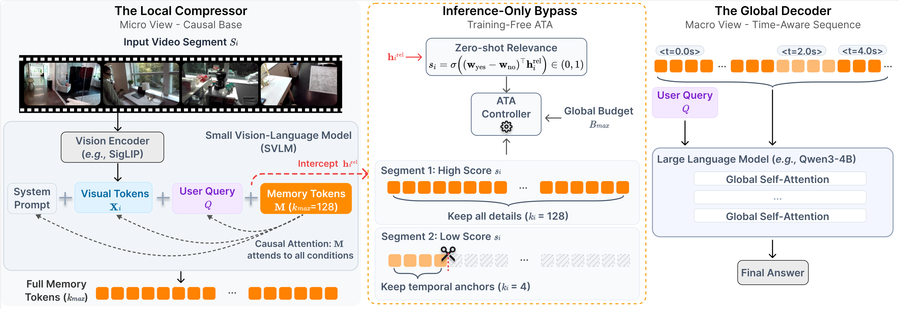

<div align="center">

# 🎥 Tempo: Small Vision-Language Models are Smart Compressors for Long Video Understanding

[](https://feielysia.github.io/tempo-page/)
[](https://arxiv.org/abs/2604.08120)
[](https://huggingface.co/spaces/Vision-CAIR/Tempo)
[](https://opensource.org/licenses/Apache-2.0)

**Tempo** is an efficient, query-aware framework that natively compresses hour-long videos for downstream Multimodal LLMs. Instead of blindly dropping frames, Tempo acts as an intelligent temporal compressor, dynamically distributing the *rhythm* of the video based on user intent.

[**Project Page**](https://feielysia.github.io/tempo-page/) | [**Paper**](https://arxiv.org/abs/2604.08120) | [**Demo**](https://huggingface.co/spaces/Vision-CAIR/Tempo)

</div>

### ✨ Highlights
* **🧠 Intent-Driven Compression (ATA):** Uses a Small VLM as an *O(1)* dynamic router to allocate dense token bandwidth to query-critical moments while rapidly fast-forwarding redundant backgrounds.
* **⚡ Extreme Efficiency:** Achieves aggressive dynamic compression (**0.5–16 tokens/frame**), bypassing the *lost-in-the-middle* phenomenon without breaking causality.
* **🏆 State-of-the-Art Performance:** Our compact **Tempo-6B** model scores 52.3 on the extreme-long LVBench (4101s) under a strict 8K visual token budget, outperforming proprietary baselines like GPT-4o and Gemini 1.5 Pro.

---

## 🎬 Watch Tempo in Action

*(Click play to see our interactive UI, dynamic token allocation visualization, and real-time inference)*

<div align="center">
  <video src="https://github.com/user-attachments/assets/d8778fd2-c658-4bf1-9a0c-48a8f5163685" width="100%" controls autoplay loop muted></video>
</div>

---

## 🔥 News
* **[2026.04]** 🚀 We have released the **Tempo-6B** inference code, interactive Gradio UI, and the final checkpoints (Stage 3)!
* **[TODO]** 📄 Our paper will be available shortly.
* **[TODO]** 📊 **Evaluation Pipeline:** We will release the full evaluation code and scripts for LVBench, Video-MME, MLVU, and LongVideoBench.
* **[TODO]** 📦 **Intermediate Checkpoints:** We plan to release the checkpoints for training Stages 0, 1, and 2 to support downstream research.
* **[TODO]** 🛠️ **Training Code:** The complete training scripts for all 4 stages will be open-sourced in the following weeks. Stay tuned!

> ⭐ **Tip:** Please **Watch** or **Star** this repository to keep an eye on our latest updates and code releases!

---

## 🚀 Quick Start

### 1. Installation

Create a new conda environment and install all required dependencies:

```bash
# Clone our repository
git clone https://github.com/FeiElysia/Tempo.git
cd Tempo

# Create environment
conda create -n tempo python=3.12 -y
conda activate tempo

# Install all packages (PyTorch 2.6.0 + CUDA 12.4)
pip install -r requirements.txt
```

> **💡 Note on Flash-Attention:** The `requirements.txt` will automatically install `flash-attn==2.7.4.post1`. If you encounter any build errors regarding `flash-attn`, simply install it manually *after* PyTorch: `pip install flash-attn==2.7.4.post1 --no-build-isolation`.

### 2. Model Zoo

To fully support the open-source community and facilitate future research, we provide the weights for our final model and will progressively release the intermediate checkpoints from **all 4 stages** of our training pipeline.

> **💡 Note on Token Budgets:** Tempo's Adaptive Token Allocation (ATA) is dynamically controlled at inference time. The 4K and 8K budget configurations reported in our paper use the **exact same final weights (Stage 3)**. You simply adjust the budget hyperparameter during inference.

| Training Stage | Description | Weights |
| :--- | :--- | :---: |
| **Stage 0** | Modality Alignment | *Coming Soon* ⏳ |
| **Stage 1** | Pre-training | *Coming Soon* ⏳ |
| **Stage 2** | Broad Supervised Fine-Tuning | *Coming Soon* ⏳ |
| **Stage 3** | **Long-Context SFT (Final Tempo-6B)** | [🤗 HF Link](https://huggingface.co/Vision-CAIR/Tempo-6B) |

*(Note: If you only want to run inference or evaluate our model, simply download the **Stage 3** weights. The checkpoints for Stage 0, Stage 1, and Stage 2 will be released alongside the training code in the following weeks.)*

### 3. Prepare Checkpoints

To run the inference script successfully, you need to download **two** components: our final `Tempo-6B` weights, and the base `Qwen3-VL-2B-Instruct` model (for Tempo initialization).

We highly recommend using the `huggingface-cli` for fast and resumable downloads:

```bash
mkdir -p checkpoints

# 1. Download the final Tempo-6B model
huggingface-cli download --resume-download Vision-CAIR/Tempo-6B --local-dir ./checkpoints/Tempo-6B

# 2. Download the base Qwen3-VL model (Required for architecture initialization)
# 💡 Note: To avoid caching Qwen3-VL in the default system drive during inference, 
# you can modify Tempo-6B's `config.json`: change "Qwen/Qwen3-VL-2B-Instruct" to "./checkpoints/Qwen3-VL-2B-Instruct" and run:
huggingface-cli download --resume-download Qwen/Qwen3-VL-2B-Instruct --local-dir ./checkpoints/Qwen3-VL-2B-Instruct
```

---

## 💻 Inference & Demos

We provide multiple ways to interact with Tempo, from web UI to highly batch scripts. 

### 1. Web UI (Gradio)

To launch the local Gradio application with interactive visualizations of the Token Allocation distribution:

```bash
python app.py
```
*Navigate to the generated local or public URL in your browser. Our UI features dynamic token compression visualization and one-click example testing.*

### 2. Single Video Inference

**Run the default example:**
We provide a quick-start script to test a pre-configured.
```bash
sh ./scripts/infer/infer.sh
```

**Run your own custom video:**
To test your own videos, call the Python script directly. Make sure to point the `--model_path` to your downloaded local checkpoint.

```bash
python infer.py \
    --model_path "./checkpoints/Tempo-6B" \
    --video_path "/path/to/your/custom_video.mp4" \
    --query "Your detailed question here."
```

### 3. Batch Inference

**Run all default examples:**
To sequentially reproduce all the qualitative examples shown on our Project Page, run:

```bash
sh ./scripts/infer/infer_all_demos.sh
```

**Run a custom batch:**
For testing across multiple custom videos, we highly recommend our JSON-based pipeline. 
Simply edit the test configurations in `./examples/demo_cases.json`:

```json
[
  {
    "video_path": "/path/to/custom1.mp4",
    "query": "Question 1"
  },
  {
    "video_path": "/path/to/custom2.mp4",
    "query": "Question 2"
  }
]
```

Once configured, execute the same batch script to automatically process them all:

```bash
sh ./scripts/infer/infer_all_demos.sh
```

---

## ✨ See Tempo in Action

Here are some unedited inference results generated directly by our **Tempo-6B** model. These examples demonstrate the model's capability in video summarization and complex QA.

<details>
<summary><b>🧠 Example 1: Complex Multi-Task Analysis & Grounding (Honkai: Star Rail)</b></summary>

<br>
<video controls autoplay loop muted src="https://github.com/user-attachments/assets/5eebb0fb-04e2-4ee3-84ca-ad77523cfe92" width="100%"></video>

> **🔷 Query:**
> 
> Task: Please analyze the provided video and answer the following 7 questions precisely.
> Q1: How many performers are visible on the stage?
> Q2: Describe the architectural elements in the background. What historical civilization do they remind you of?
> Q3: What is happening in the night sky above the performers, and what does this suggest about the event?
> Q4: List the hair colors of the performers in order from left to right.
> Q5: Identify the specific musical instrument being played by the performer located on the far left of the stage.
> Q6: What is the specific time interval (in seconds, e.g., XX-XXs) during which this fireworks performance scene occurs in the video?
> Q7: Look at the audience in the foreground. How does their silhouette-like depiction affect the viewer's perspective of the stage?

> **🔴 Tempo Response:** ⏱️ `Refer to 1:27 - 1:30`
> 
> **Q1:** There are four performers visible on the stage.<br>
> **Q2:** The architectural elements in the background resemble ancient Greek columns, suggesting a historical setting reminiscent of ancient Greece.<br>
> **Q3:** The night sky above the performers is filled with fireworks, suggesting a celebratory event or performance.<br>
> **Q4:** The hair colors of the performers from left to right are purple, pink, blonde, and blue.<br>
> **Q5:** The performer on the far left is playing a harp.<br>
> **Q6:** The fireworks performance scene occurs between 88.0-91.0 seconds.<br>
> **Q7:** The silhouette-like depiction of the audience in the foreground creates a sense of depth and focus on the performers on stage, enhancing the viewer's perspective of the stage.

</details>

<details>
<summary><b>🔥 Example 2: Video Summarization (Honkai Impact 3rd)</b></summary>

<br>
<video controls autoplay loop muted src="https://github.com/user-attachments/assets/dbdd9985-9ed5-45d6-b42d-d35aa2dd4fc1" width="100%"></video>

> **🔷 Query:**
> Describe the video in detail.

> **🔴 Tempo Response:** ⏱️ `Global Summary`
> 
> The video opens with a high-tech, neon-lit cityscape at night, filled with floating structures and digital screens. A character with pink hair and a blue eye patch is seen running through the city, dodging obstacles. The environment is dark with vibrant neon colors, primarily purples, blues, and greens. The character is dressed in a futuristic outfit with a weapon. As the character moves, they are surrounded by digital elements and symbols, suggesting a cyberpunk setting. The scene shifts to a close-up of the character's face, showing determination and focus. The character is then seen in a combat stance, ready to fight. The lighting is dynamic, with flashes of light and energy. The video ends with a black screen displaying credits in white text.

</details>

---

## 🧠 Methodology: The Tempo Framework

Tempo bridges the gap between hour-long videos and bounded LLM context windows by casting long video understanding as an end-to-end, **query-aware cross-modal distillation** process. 

<div align="center">
  
</div>

Instead of blindly sampling frames, our pipeline operates in three highly efficient phases:

*  **1. Local Compressor (Early Distillation):** A Small VLM (SVLM) processes video segments alongside the user query. It uses learnable memory tokens to inherently distill visual semantics, dropping query-irrelevant backgrounds early on.
* **2. Adaptive Token Allocation (ATA):** Operating as a training-free, *O(1)* dynamic router during inference, ATA intercepts zero-shot relevance scores from the SVLM. It allocates dense token bandwidth to query-critical segments while rapidly fast-forwarding redundancies into minimal *temporal anchors*.
* **3. Global Decoder (Synthesis):** The highly compressed, filtered memory tokens are assembled with explicit temporal tags (*e.g.,* `<t=2.0s>`). A large global LLM then synthesizes this condensed storyline to generate precise answers without suffering from attention dilution.

---

## 📊 Quantitative Results

Tempo achieves state-of-the-art performance on extreme-long video benchmarks while using a fraction of the token budget compared to traditional models.

| Model | Size | Tokens / Frame | LongVideoBench | MLVU | Video-MME | LVBench |
| :--- | :---: | :---: | :---: | :---: | :---: | :---: |
| **Proprietary Models** | | | | | | |
| GPT-4o | - | - | 66.7 | 64.6 | 71.9 | 30.8 |
| Gemini 1.5 Pro | - | - | 64.0 | - | 75.0 | 33.1 |
| **General Open-Source** | | | | | | |
| VideoLLaMA3* | 7B | &le; 91 | 59.8 | 73.0 | 66.2 | 45.3 |
| Qwen2.5-VL | 7B | 1924 | 56.0 | 70.2 | 65.1 | 45.3 |
| Qwen3-VL* | 8B | &le; 640 | - | 78.1 | 71.4 | 58.0 |
| **Specialized Long Video** | | | | | | |
| LongVA | 7B | 144 | - | 56.3 | 52.6 | - |
| Kangaroo | 8B | 256 | 54.8 | 61.0 | 56.0 | 39.4 |
| LongVU | 7B | 64 | - | 65.4 | 60.6 | - |
| VideoChat-Flash | 7B | 16 | 64.7 | 74.7 | 65.3 | 48.2 |
| **Tempo* (4K Budget)** | **6B** | **0.5–16** | **64.5** | **75.6** | **67.8** | **52.7** |
| *&#8627; actual avg. toks/frame*| | | 2.8 | 2.8 | 3.6 | 2.9 |
| **Tempo* (8K Budget)** | **6B** | **0.5–16** | **65.1** | **75.2** | **67.7** | **52.3** |
| *&#8627; actual avg. toks/frame*| | | 3.1 | 3.3 | 4.3 | 3.5 |

> 💡 **Note:** While configured with a theoretical dynamic range of 0.5–16 tokens, Tempo's **Adaptive Token Allocation (ATA)** inherently operates substantially below the maximum limits in practice (see the *actual avg.* rows). For the complete leaderboard and exhaustive metrics, please visit our [Project Page](https://feielysia.github.io/tempo-page/).

---

## 🧪 Evaluation & Training (Coming Soon)

We are currently cleaning up the codebase for our evaluation pipeline and training scripts. 

- [ ] **Evaluation Pipeline:** Scripts to reproduce results on LVBench, Video-MME, MLVU, and LongVideoBench.
- [ ] **Training Scripts:** Full pipeline for the progressive training curriculum.

*Please watch/star the repository to get notified when these are released!*

---

## 🔮 Next Steps

While Tempo provides a strong foundation for long video understanding, it opens up several exciting possibilities for the community. Potential avenues for future research include:

- **Routing Post-Training:** Enhancing the SVLM's zero-shot routing precision via RL to elicit stronger relevance priors.
- **Autoregressive Compression:** Exploring reasoning-driven, dynamic length token generation for query-aware segment compression.
- **Multi-Turn Efficiency:** Implementing hierarchical, on-demand visual extraction to support extremely fast multi-turn dialogue.

---

## 📝 Citation

If you find our work useful for your research and applications, please consider citing our paper:

```bibtex
@article{fei2026small,
  title={Small Vision-Language Models are Smart Compressors for Long Video Understanding},
  author={Fei, Junjie and Chen, Jun and Liu, Zechun and Xiong, Yunyang and Zhou, Chong and Wen, Wei and Han, Junlin and Zhuge, Mingchen and Suri, Saksham and Qian, Qi and others},
  journal={arXiv preprint arXiv:2604.08120},
  year={2026}
}
```

---

## 🤝 Acknowledgements

Junjie Fei, Mingchen Zhuge, Shuming Liu, and Mohamed Elhoseiny were supported by funding from the **KAUST Center of Excellence for Generative AI**. 

We extend our sincere gratitude to the open-source community for their invaluable contributions that made this research possible:

* **Evaluation Benchmarks:** [LVBench](https://lvbench.github.io/), [Video-MME](https://video-mme.github.io/), [MLVU](https://github.com/JUNJIE99/MLVU), and [LongVideoBench](https://longvideobench.github.io/).
* **Codebase Foundations:** Our codebase is built upon the excellent architectures of [LongVU](https://github.com/Vision-CAIR/LongVU), [VideoChat-Flash](https://github.com/OpenGVLab/VideoChat-Flash), and [LLaVA](https://github.com/haotian-liu/LLaVA).
* **Pre-trained Weights:** Our models are initialized using the powerful foundational models from [Qwen3-VL](https://github.com/QwenLM/Qwen3-VL) and **Qwen3-LM**.
* **Project Page:** Our website template is adapted from the beautiful [Nerfies](https://github.com/nerfies/nerfies.github.io) project.

---

## 📄 License & Disclaimer

* ⚖️ **Framework & Code:** The **Tempo** framework's source code is open-sourced under the **[Apache-2.0 License](https://opensource.org/licenses/Apache-2.0)** to foster research and community development. 
* 🚫 **Model Weights:** The pre-trained model weights and checkpoints are distributed strictly for **academic and non-commercial research purposes**. Any commercial use is explicitly prohibited without prior written consent.
* 🎬 **Video & Data Assets:** All visual media (video clips, images) showcased on our project page and within evaluation pipelines are utilized under the doctrine of **Fair Use** exclusively for non-profit academic research and scientific illustration. We claim no ownership over the original, copyrighted media assets.

**Take-down Notice:** We deeply respect the intellectual property rights of creators. If you are a copyright holder and believe that any content hosted in this repository or our project page infringes upon your rights, please contact us at **[junjiefei@outlook.com](mailto:junjiefei@outlook.com)** or open an **[Issue](https://github.com/FeiElysia/Tempo/issues)**. We will promptly investigate and remove the identified content upon verification.